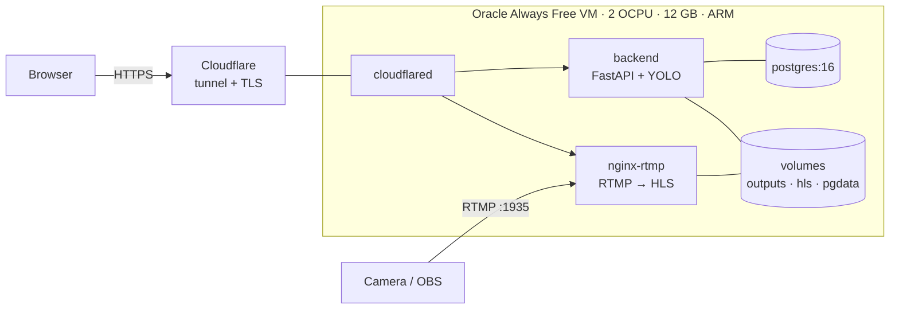

# Deploying the live demo

The [Deployment](../README.md#deployment) section of the README describes the AWS
architecture the system was designed for. This document describes the **free
deployment that runs the public demo**: one small VM running the whole stack.

## Why a VM and not a PaaS free tier

The backend loads YOLO weights into memory at import time. Measured on the image
this repository builds, running on CPU:

```
image size                        843 MB
after importing torch             260 MB
after loading the weights         353 MB
after one 1080p inference         526 MB
peak, several inferences          575 MB
```

Peak resident memory is the number that decides where this can run, and it is not
the idle figure: inference allocates several times what the loaded model occupies.
That rules out most of the obvious options:

| Option | Free RAM | Verdict |
|--------|----------|---------|
| Render, Koyeb | 512 MB | A 575 MB peak does not fit; killed on the first inference |
| Fly.io | — | No free tier for new accounts |
| Hugging Face Spaces | 16 GB | Docker Spaces require a paid plan |
| Google Cloud Run | configurable | Works, but a cold start pays 40–60 s to load torch, and it only exposes HTTP |
| GCP Compute Engine `e2-micro` | 1 GB | Always free, works, but 0.25 vCPU sustained makes inference slow |
| **Oracle Always Free (Ampere A1)** | **12 GB** | What this guide uses |

There is a second reason. **LiveCams need RTMP on port 1935**, and every PaaS free
tier exposes HTTP and nothing else. On a VM the whole system is demonstrable,
including the part that is hardest to build.

## What it looks like



Nothing listens on the VM's public IP except RTMP. The API and the HLS server are
reached through the tunnel, so there is no certificate to renew and no inbound
HTTP port to leave open.

## 1. Create the VM

In the Oracle Cloud console, create a compute instance:

- **Shape: `VM.Standard.A1.Flex`** with 2 OCPU and 12 GB of memory. This matters:
  the always-free AMD micro shapes have 1 GB of RAM and cannot even build the
  image, let alone run it.
- **Image:** Ubuntu 22.04 or 24.04 (ARM64 build).
- **Boot volume:** 50 GB is plenty and stays inside the free 200 GB.
- Save the SSH key it offers you.

> **If it says "Out of capacity"** — that is normal for the free ARM shape and not
> a problem with your account. Try another availability domain, or a region with
> three of them. Retrying over a few hours usually works.

Then open **1935/TCP** in the instance's security list *and* in the VM firewall:

```bash
sudo iptables -I INPUT -p tcp --dport 1935 -j ACCEPT
sudo netfilter-persistent save     # Ubuntu images ship with iptables rules
```

Only 1935 needs to be open. The tunnel makes the outbound connection itself.

## 2. Install Docker

```bash
sudo apt-get update && sudo apt-get install -y docker.io docker-compose-v2 git
sudo usermod -aG docker $USER && newgrp docker
```

## 3. Get the code and configure it

```bash
git clone https://github.com/Mampiz/birdvision.git && cd birdvision
cp backend/.env.example .env
```

Edit `.env`. The values that matter in production:

```bash
ENV=prod
JWT_SECRET=            # openssl rand -base64 48 — the app refuses to start in prod without a real one
POSTGRES_PASSWORD=     # openssl rand -base64 32

PUBLIC_BASE_URL=https://api.yourdomain.com
FRONTEND_ORIGINS=https://yourfrontend.example
HLS_PUBLIC_BASE=https://hls.yourdomain.com

CLOUDFLARE_TUNNEL_TOKEN=   # from step 4

# A 2 OCPU box should not try to decode two videos at once.
MAX_CONCURRENT_JOBS=1
FRAME_MAX_CONCURRENT_INFER=1
```

`.env` is gitignored. Keep it that way: it holds the JWT signing key, the database
password and the tunnel token.

## 4. Create the Cloudflare tunnel

> **Prerequisite: a domain on Cloudflare.** Published hostnames require a website
> added to your Cloudflare account. If you do not have one, see
> [without a domain](#without-a-domain) below.

Go to [**Networking → Tunnels**](https://dash.cloudflare.com/?to=/:account/tunnels),
create a tunnel, and choose **Docker** when it offers you an install command. The
command contains `--token eyJ...`; that token is what goes into
`CLOUDFLARE_TUNNEL_TOKEN` in `.env` — the compose file runs cloudflared for you,
so you do not run the command it shows.

Then, on the tunnel's **Routes** tab, **Add route → Published application** twice:

| Subdomain | Service URL |
|-----------|-------------|
| `api` | `http://backend:8000` |
| `hls` | `http://nginx-rtmp:8080` |

Those service URLs use the compose service names, not `localhost`: cloudflared
runs as a container on the same network and reaches its neighbours by name.

The second one is what lets a browser play the HLS stream over HTTPS. Without it
the page loads over TLS and the video does not, and the browser blocks it as mixed
content.

## 5. Start it

```bash
docker compose -f docker-compose.prod.yml up -d --build
```

The first build takes a while — torch is a 190 MB wheel — but nothing is compiled
from source: PyTorch publishes `manylinux_2_28_aarch64` wheels, so ARM is a
download, not a build. Then:

```bash
curl https://api.yourdomain.com/health
# {"status":"ok","model":"bestgen.pt","workers":1}
```

## 6. Point the frontend at it

Rebuild the SPA with the API base pointing at the tunnel:

```bash
VITE_API_BASE=https://api.yourdomain.com npm run build
```

`FRONTEND_ORIGINS` on the backend has to name that frontend's origin exactly, or
the browser will refuse the responses on CORS grounds.

## 7. Publish a camera

From anywhere, with ffmpeg or OBS:

```bash
ffmpeg -re -i input.mp4 -c:v libx264 -preset veryfast -tune zerolatency \
       -c:a aac -f flv rtmp://<vm-public-ip>:1935/live/cam1
```

nginx writes the HLS segments into the shared volume, the backend lists them, and
the camera appears in the grid within a couple of seconds.

## Operating it

```bash
docker compose -f docker-compose.prod.yml logs -f backend
docker compose -f docker-compose.prod.yml ps          # health column
docker compose -f docker-compose.prod.yml pull && \
  docker compose -f docker-compose.prod.yml up -d --build   # update

# Database backup
docker compose -f docker-compose.prod.yml exec db \
  pg_dump -U postgres birdsdb > backup-$(date +%F).sql
```

### What to expect from the hardware

Inference runs on 2 ARM cores with no GPU, so a single image takes on the order of
a second rather than the tens of milliseconds quoted in the
[Results](../README.md#results) section, which were measured on a GPU. Video jobs
are proportionally slower, which is why `MAX_CONCURRENT_JOBS` is 1.

The demo is there to show that the system works end to end, not to reproduce the
benchmark.

### Without a domain

Published hostnames need a domain in your Cloudflare account. Two ways around it:

- **A free subdomain plus Caddy.** Register a name at
  [DuckDNS](https://www.duckdns.org) or similar, point it at the VM's public IP,
  open 80 and 443, and put [Caddy](https://caddyserver.com) in front of the
  backend. Caddy obtains and renews a Let's Encrypt certificate on its own. You
  drop the `tunnel` service from the compose file.
- **A quick tunnel.** `cloudflared tunnel --url http://localhost:8000` gives a
  free `*.trycloudflare.com` URL with no account at all — but it is random and
  changes every restart, so the frontend would have to be rebuilt each time. Fine
  for showing someone something today, not for a demo that has to keep working.

### If the container is killed

`docker compose ... ps` showing the backend restarting usually means the box ran
out of memory during a video job. Lower `MAX_CONCURRENT_JOBS` and
`FRAME_MAX_CONCURRENT_INFER` to 1, and add swap:

```bash
sudo fallocate -l 4G /swapfile && sudo chmod 600 /swapfile
sudo mkswap /swapfile && sudo swapon /swapfile
echo '/swapfile none swap sw 0 0' | sudo tee -a /etc/fstab
```
